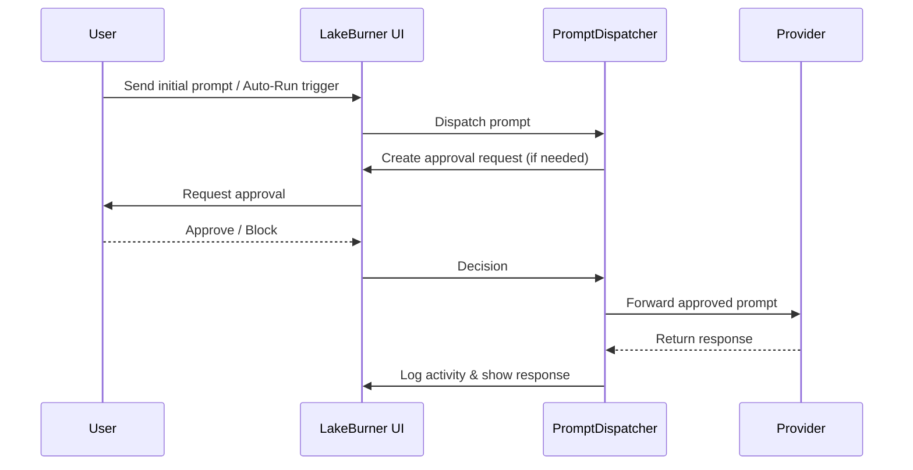

# LakeBurner

LakeBurner is a User-Approval Harness for AI coding assistants in Visual Studio Code. It sits alongside Copilot Chat, Claude Code, and Codex, monitoring their presence and gating risky actions through the `@lakeburner` approval workflow.

## Table of Contents

- Quick Start
- Features
- How It Works
- Supported Providers
- Configuration
- Activity & UI
- Security & Privacy
- FAQ / Troubleshooting
- Development
- Contributing
- License / Links

## Quick Start

1. Clone or download this repository and open it in VS Code.
2. Install dependencies:

```bash
npm install
```

3. Build the extension:

```bash
npm run build
```

4. Launch an Extension Development Host from the Run panel to try LakeBurner.

Example Initial Prompt:  
@lakeburner Please create a CSV of various foods and information about them. Set that CSV in `C:\Users\5798017\Downloads` and name it "Cornucopia.csv". If one already exists, scan its contents and improve on it logically, qualitatively, or quantitvely.


## Features

- **Approval Harness:**
	Intercepts and manages actions that could modify files, run commands, or perform other risky operations, requiring explicit user approval via the `@lakeburner` workflow.

- **Provider Monitoring:**
	Detects and shows the status of integrated AI providers.

- **Auto-Run Mode:**
	Optional auto-execution mode with safety settings and an internal ticker that controls when prompts are dispatched.

- **Activity Log & UI:**
	Centralized activity log (requests, approvals, blocks, info) and a Webview UI for easy monitoring.

- **Affected Chats Management:**
	Arm or disarm specific chat sessions for automation to limit automated actions to intended sessions.

- **Prompt Dispatcher:**
	Routes prompts to selected provider endpoints and manages default prompts for new sessions.

## How It Works

At a high level, LakeBurner sits between the user, the chat UI, and the language-model providers. The main flow:

1. User or automation triggers a prompt (manual Send Initial Prompt, `@lakeburner start`, or Auto-Run).
2. `PromptDispatcher` evaluates the prompt and target provider(s).
3. If the action is sensitive, LakeBurner creates an activity entry and requests user approval.
4. User approves or blocks the action via the UI; approvals may include options like "Allow once" or "Keep" (allow without further prompts).
5. Approved prompts are forwarded to the provider; responses are returned to the chat and logged.

Mermaid sequence (renderable in compatible viewers):



## Supported Providers

LakeBurner currently includes integrations and monitoring for:

- GitHub Copilot Chat
- Anthropic Claude (via Claude Code/Chat integrations)
- OpenAI Codex/ChatGPT (where integrated into editors)

Note: Exact provider support is governed by installed VS Code extensions and their exposed APIs. LakeBurner detects providers via the VS Code language-model provider hooks.

If you use other providers, LakeBurner will show them in the Providers list if they implement the Language Model Tool / ChatParticipant APIs.

## Configuration

Configure LakeBurner under the `lakeburner` settings section in VS Code (Settings → Extensions → LakeBurner). Common options:

- `lakeburner.autoRun`: Enable or disable Auto-Run mode.
- `lakeburner.approvalBehavior`: Default approval behavior for trusted sessions.
- `lakeburner.tickerInterval`: Interval (ms) used by the Auto-Run ticker (0 disables automatic ticks).

## Activity & UI

- **Activity Log:** Records events with timestamps and kinds (`REQUEST`, `APPROVE`, `BLOCK`, `INFO`).
- **Affected Chats panel:** Shows currently armed chat sessions and allows manual control.
- **Popout:** A compact activity popout window is available for quick monitoring.

## Security & Privacy

- LakeBurner runs locally inside your VS Code instance and does not transmit activity logs or approvals outside your machine.
- Provider requests and responses are sent directly to the provider endpoints through the installed provider extensions — LakeBurner does not proxy or persist provider credentials.
- Activity logs are stored in-memory and in extension `globalState` for session persistence; do not use LakeBurner to store sensitive secrets.
- For high-security setups, disable Auto-Run and require manual approvals for all actions.

## Development

- **Source Structure:**
	- `src/main.ts` — Extension entry point and activation logic
	- `src/backend/` — Activity logging, provider monitoring, ticker, approvals
	- `src/frontend/` — Webview UI, TS logger, and client-side code

- **Build:**
```bash
npm install
npm run build
```

- **Run:**
	- Open the project in VS Code and run the Extension Development Host.

## Contributing

Contributions welcome — open issues or PRs on GitHub. Please follow the repository's contribution guidelines and include tests where applicable.

## License

MIT

## Links

- [GitHub Repository](https://github.com/JBLDotExe/LakeBurner)
- [Report Issues](https://github.com/JBLDotExe/LakeBurner/issues)

---